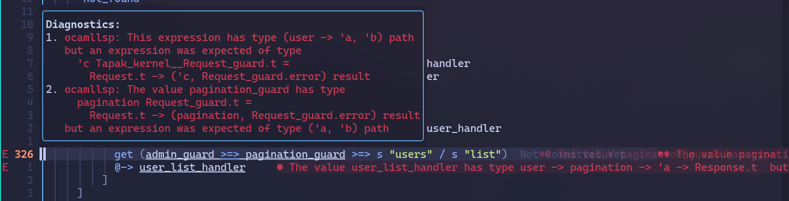
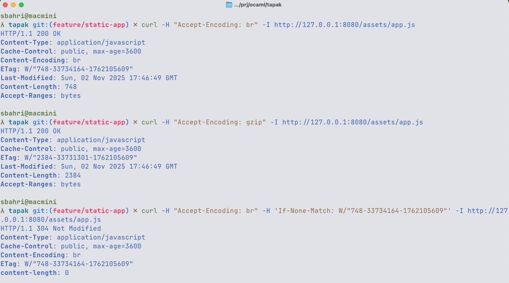

+++
title = 'Tapak'
date = '2025-10-01'
draft = false
description = 'Tapak is a composable framework for building web applications in OCaml'
language = 'OCaml'
tech_stack = []
github_url = 'https://github.com/syaiful6/tapak'
documentation_url = 'https://syaiful6.github.io/tapak/'
featured = true
+++

OCaml web frameworks work well, but they miss opportunities to leverage OCaml's unique strengths and twists.

For example, both [Opium](https://github.com/rgrinberg/opium) and [Dream](https://github.com/camlworks/dream) use
traditional string-based routing systems. Compare them with Haskell's [Servant](https://www.servant.dev/), which uses advanced type-level programming to provide type-safe routing and
automatic API generation.

Another example is Rust's [Warp](https://github.com/seanmonstar/warp), which uses _Filter_ systems. These leverage Rust's
powerful type and trait system to provide composable and type-safe routing and automatic conversion from types to HTTP responses.

Both depend on [Lwt](https://ocsigen.org/lwt/latest/manual/manual) for their asynchronous programming model—
the older asynchronous I/O runtime. This is understandable since they were written before OCaml 5.

OCaml 5 introduces algebraic effects, this means we can express asynchronous I/O without any monads at all.
[EIO](https://github.com/ocaml-multicore/eio) is a new I/O runtime for OCaml that uses algebraic effects
and direct-style concurrency. We don't need monad transformers, and the composability of monads
is no longer a concern. Why not leverage that instead?

I mean, instead of using Lwt's monadic style:

```ocaml
(** int64 -> Request.t -> Response.t Lwt.t *)
let handler id request =
    let* user = Database.get_user_by_id id in
    let* posts = Database.get_posts_by_user user in
    Lwt.return (Response.of_json posts)
```

We can write it in direct style with EIO:

```ocaml
(** int64 -> Request.t -> Response.t *)
let handler id request =
    let user = Database.get_user_by_id id in
    let posts = Database.get_posts_by_user user in
    Response.of_json posts
```

The monadic style is powerful, but it doesn't compose well with other abstractions. For example, if you have validation
abstractions, you will end up with a mess of monad transformers. In practice, you will often need to validate
data based on the state you have in the database layer. So `string -> bool` validation functions are not enough; you need
`string -> bool Lwt.t` functions. Composing these with Lwt becomes cumbersome quickly.

The error handling in Lwt is also not ideal. We can't use language constructs like `try...with` to catch errors in Lwt computations.

So I decided to explore building my own web framework built upon EIO and providing more modern features
I found lacking in existing frameworks. Let me introduce you to **Tapak**.

## The Problem with Traditional Routing

Traditional routing APIs require you to manually extract and parse parameters:

```ocaml
Dream.get "/users/:id/posts/:slug" (fun request ->
  let user_id = Dream.param request "id" |> Int64.of_string in
  let slug = Dream.param request "slug" in
  handler user_id slug request)
```

Problems with this approach:

- Parameters come as strings, requiring manual parsing
- Type mismatches only caught at runtime
- It's easy to make typos in parameter names
- No compile-time guarantees

Here's how Tapak solves this:

```ocaml
(* Tapak: type-safe parameter extraction *)
get (s "users" / int64 / s "posts" / str) @-> fun user_id slug req ->
  handler user_id slug req
  (* user_id is already int64! slug is already string! *)
```

The magic? The compiler knows `user_id` is `int64` and `slug` is `string`. If you try to use them incorrectly,
you get a compile error, not a runtime crash.

Let me show you how it works.

## Type-Safe Routing with GADTs

What if we could encode the route structure directly in the type system, so the compiler can:

1. Validate that handlers receive the correct parameter types
2. Generate URLs from the same route definitions
3. Catch routing errors at compile time, not runtime

Since we wanted to match routes and extract parameters in a type-safe way, we need a way to represent
path patterns with types. This is where GADTs come in. They allow us to specify the exact types of parameters
they return, enabling us to encode rich type-level information.

Let's define a GADT to represent path patterns:

```ocaml
type (_, _) path =
  | Nil : ('a, 'a) path
  | Literal : string * ('a, 'b) path -> ('a, 'b) path
  | Int64 : ('a, 'b) path -> (int64 -> 'a, 'b) path
  | String : ('a, 'b) path -> (string -> 'a, 'b) path
  | Method : Piaf.Method.t * ('a, 'b) path -> ('a, 'b) path
  (* ... more constructors *)
```

Here's a breakdown of how we express path patterns with types:

1. **Two type parameters**: `('a, 'b) path`
   - `'a`: The accumulated function type (builds up as we add parameters)
   - `'b`: The final return type

2. **Type threading**: Each constructor modifies the first type parameter to "accumulate" extracted values

The end goal is to have a type like `(int64 -> string -> Request.t -> Response.t, Response.t) path` for a route like
`/users/:id/posts/:slug`, which means the handler must accept an `int64`, a `string`, and a `Request.t`, and return a `Response.t`.

Let's define functions to describe the path patterns:

```ocaml
let int64 = Int64 Nil
(* int64 : (int64 -> 'a, 'a) path *)
let str = String Nil
(* str : (string -> 'a, 'a) path *)
let s literal = Literal (literal, Nil)
(* s : string -> ('a, 'a) path *)

(** more path functions *)
```

We also need a way to compose paths to achieve `(int64 -> string -> 'a, 'a) path`. For that, we define the `/` operator:

```ocaml
let rec ( / ) : type a b c. (a, c) path -> (c, b) path -> (a, b) path =
 fun left right ->
  match left with
  | Nil -> right
  | Literal (lit, rest) -> Literal (lit, rest / right)
  | Int64 rest -> Int64 (rest / right)
  | String rest -> String (rest / right)
  (* ... *)
```

The `/` operator **composes** paths by recursively threading the right side into the left side's `rest` parameter.
This is how we chain multiple segments together.

Let's see how this works in practice:

```ocaml
get (s "users" / int64) @-> user_handler
```

Type evolution:

1. `s "users"` → `('a, 'a) path` (no parameters extracted)
2. `/ int64` → `(int64 -> 'a, 'a) path` (adds int64 parameter)
3. `get` → Wraps in Method GET
4. `@-> user_handler` → Requires handler of type `int64 -> Request.t -> Response.t`

### Pattern Matching and Extraction

Since we have the path patterns encoded in types, we need a way to **evaluate** them at runtime to match incoming requests.

As we match the path segments, we also need to extract parameters and build up the handler function call. Fortunately,
the type system will guide us to ensure we evaluate them correctly.

```ocaml
let rec match_pattern : type a b.
  (a, b) path -> string list -> Request.t -> a -> b option
  =
 fun pattern segments request k ->
  match pattern, segments with
  | Nil, [] -> Some k
  | Literal (expected, rest), seg :: segs when String.equal expected seg ->
    match_pattern rest segs request k
  | Int64 rest, seg :: segs ->
    (match parse_int64 seg with
    | Some n -> match_pattern rest segs request (k n)  (* Apply extracted value to continuation *)
    | None -> None)
  | String rest, seg :: segs -> match_pattern rest segs request (k seg)
  (* ... *)
```

`k` is a partially applied handler function. As we extract parameters from the URL, we progressively apply them to `k`,
building up the final function call.

For `get (s "users" / int64) @-> fun id req -> ...`:

1. Match `"users"` → continue with same `k`
2. Parse `"123"` as `int64` → apply to `k`, getting `k 123L`
3. Reach `Nil` → return `Some (k 123L request)`, which evaluates the handler

### Request Guards

I've been working on web applications since my early career, and one common pattern I've found is validating requests—
like requiring certain headers, authentication, or specific content types. This is usually handled outside the routing API.

Certainly, we can add middleware for that. But we can't express it in the type system, leading to potential mismatches.
I've made mistakes a few times where I forgot to attach the correct authentication middleware to a route.
It's also not particularly clear just by looking at the handler definition. It's much clearer if the handler is declared as follows:

```ocaml
let admin_handler user req = ...
```

The `user` parameter explicitly tells me this handler requires an authenticated user. The routing system should
only call this handler if the request is authenticated. I found this pattern really useful.

So I decided to add **Request Guards** to Tapak's routing system. Here's how it looks:

```ocaml
let ( >=> ) : type a b g. g Request_guard.t -> (a, b) path -> (g -> a, b) path =
 fun guard pattern -> Guard (guard, pattern)
```

Usage example:

```ocaml
get (user_guard >=> s "users" / int64) @-> fun user id req ->
  (* user : User.t, id : int64, req : Request.t *)
  Response.of_string ~body:(Printf.sprintf "User %s viewing %Ld" user.name id) `OK
```

Guards add validated data extraction before path matching. The type `(g -> a, b) path` shows that the guard's result (`g`)
becomes the first parameter.

**Composing multiple guards:**

Request guards are normal functions, so we can compose them naturally. Tapak provides combinators to help with that.

Their definition is straightforward:

```ocaml
type error = ..

type 'a t = Request.t -> ('a, error) result
```

Here's an example combinator to combine two guards. Both must succeed, and their results are combined into a tuple.

```ocaml
(* &&& combinator combines two guards, both must succeed *)
let authenticated_json = Request_guard.(user_guard &&& json_body) in

post (authenticated_json >=> s "api" / s "posts") @-> fun (user, json_data) req ->
  (* user: User.t, json_data: Json.t, req: Request.t *)
  create_post user json_data
```

### URL Generation

Another use-case of routing systems is generating URLs. Django and Rails provide helpers to generate it
based on route names.

We can use the same GADT path patterns to generate URLs in a type-safe way. Just like our favorite
OCaml `sprintf` function, we can define a `sprintf` function that takes a path pattern.

```ocaml
let rec sprintf' : type a. (a, string) path -> string -> a =
 fun pattern acc ->
  match pattern with
  | Nil -> acc
  | Literal (s, rest) -> sprintf' rest (acc ^ "/" ^ s)
  | Int64 rest -> fun n -> sprintf' rest (acc ^ "/" ^ Int64.to_string n)
  | String rest -> fun s -> sprintf' rest (acc ^ "/" ^ s)
  (* ... *)

(* Usage *)
let user_path = s "users" / int64
let url = sprintf user_path 42L  (* "/users/42" *)
```

There you go, type-safe URL generation using the same path patterns.

### Routing Scope

Most web frameworks provide a way to group routes under a common prefix or apply middleware.
This is usually called "scopes" or "namespaces," and it's useful for organizing routes,
applying common middleware, or versioning APIs.

Tapak provides routing scopes as well:

```ocaml
App.(
    routes
      ~not_found
      [ get (s "") @-> home_handler
      ; get (s "users" / int64) @-> user_handler
      ; scope
          ~middlewares:[api_auth_middleware]
          (s "api")
          [ get (s "version") @-> api_version_handler
          ; scope
              ~middlewares:
                [ require_email_confirmed_middleware
                ]
              (s "users")
              [ get (s "") @-> api_users_handler
              ; get int64 @-> api_detail_user_handler
              ; post int64 @-> api_update_user_handler
              ]
          ]
       ]
    ()

```

### Want to try it out?

You can install Tapak using Opam by pinning the GitHub repository:

```bash
# Pin from GitHub
opam pin add tapak https://github.com/syaiful6/tapak.git

# Install dependencies
opam install tapak --deps-only
```

Or you can use Nix Flakes. Add Tapak as a flake input in your `flake.nix`, and you know the rest, right?
You use nix btw.

```nix
{
  inputs = {
    tapak.url = "github:syaiful6/tapak";
    # Or specify a branch:
    # tapak.url = "github:syaiful6/tapak/main";
  };

  outputs = { self, tapak, ... }: {
    # Use tapak in your development environment or package build
  };
}
```

### Cons of GADT-Based Routing

To be honest, GADT-based routing is not without trade-offs. It is more complex and requires a DSL, which means you need
to learn new concepts and familiarize yourself with the API.

The error messages can be quite cryptic and intimidating for newcomers. Consider this code:

```ocaml
get (admin_guard >=> pagination_guard >=> s "users" / s "list") @-> user_list_handler
```

What's wrong with it? The error message might look like this:

{{}}

See? The error messages can be overwhelming. They basically say the `>=>` operator was applied to the wrong arguments—
it needs to be applied to a path pattern, but here it was applied to another guard instead. The fix is simple: just add
parentheses to make the grouping explicit:

```ocaml
get (admin_guard >=> (pagination_guard >=> s "users" / s "list")) @-> user_list_handler
```

But I believe the benefits outweigh the costs.

Since OCaml has ppx, we can use it to generate the GADT routes from a more familiar string-based syntax. I tried
using Django-style route definitions with ppx, and it [works quite well](https://github.com/syaiful6/tapak/blob/main/examples/reason/main.re).

I focused on building a solid foundation with the GADT-based routing system first. Once that's stable,
I can explore building ppx-based route definitions to lower the barrier to entry.

## Static File Serving

Another feature I found lacking in OCaml web frameworks is robust static file serving. Both Opium and Dream provide
static file serving, but they simply serve files from a directory with limited support for advanced optimizations,
such as range requests, conditional requests, caching headers, pre-compressed files with content encoding negotiation,
and other optimizations that are important for serving static files efficiently.

They also lack flexibility. What if I want to serve files from embedded resources, from a CDN, or generate files on the fly?

This is why I decided to implement a more robust static file serving solution in Tapak.

{{}}

The API looks like this:

```ocaml
let cwd = Eio.Stdenv.cwd env in
let public_dir = Eio.Path.(cwd / "examples" / "static-files" / "public") in
let fs_backend = Static.filesystem ~follow:false public_dir in
let static_config =
  { Static.default_config with
    max_age = `Seconds 3600 (* Cache for 1 hour *)
  ; use_weak_etags = true
  ; serve_hidden_files = false
  ; follow_symlinks = false
  ; index_files = [ "index.html"; "index.htm" ]
  }
in
let app =
  App.(
    routes
      [ get (s "static" / splat) @-> Static.serve fs_backend ~config:static_config () ]
      ()
  )
```

The `fs_backend` is a static file backend that serves files from the filesystem. It can be replaced with other backends
by implementing Tapak's Static STORAGE module signature. For example, I can implement an embedded file backend generated
by [OCaml-crunch](http://github.com/mirage/ocaml-crunch).

## Ongoing Features: Real-Time

Modern web applications have evolved beyond the traditional request-response model. Users now expect instant updates,
collaborative features, live data streams, and more.

Think about it—if you wanted to build a web application that can analyze chess games with coaches or friends in real-time,
this feature is a must-have. This is why WebSockets and Server-Sent Events (SSE) have become essential primitives in
modern web frameworks.

Tapak already supports SSE, and WebSockets are available through [Piaf](https://github.com/anmonteiro/piaf).

Node.js's socket.io and Elixir's Phoenix Channels are popular solutions for building real-time web applications. Their
client libraries make it easy to connect to the server and handle real-time events.

If we can implement their protocols in OCaml, we can leverage their existing clients, which would be a huge win.
Supporting a custom protocol would mean building both client and server libraries, which is significantly more work.

This is an ongoing project—I'm exploring building the Phoenix Channels protocol in OCaml, which is more feature-rich compared
to Socket.IO. It has presence tracking, which is useful for showing online users, typing indicators, etc.

<blockquote class="twitter-tweet"><p lang="en" dir="ltr">Sunday project: Cooking up a real-time communications API in <a href="https://twitter.com/hashtag/OCaml?src=hash&amp;ref_src=twsrc%5Etfw">#OCaml</a>. 🐫 <a href="https://t.co/BnC9Tx40hu">pic.twitter.com/BnC9Tx40hu</a></p>&mdash; Syaiful Bahri (@kicauipul) <a href="https://twitter.com/kicauipul/status/1990060299186262138?ref_src=twsrc%5Etfw">November 16, 2025</a></blockquote> <script async src="https://platform.twitter.com/widgets.js" charset="utf-8"></script>

## Conclusion

This is what I've built so far with Tapak. It's still a work in progress and an experiment on what an OCaml web framework
could look like when built on modern OCaml with everything I've learned so far. But I'm excited about the possibilities!

The GADT-based routing system shows that type safety and ergonomics don't have to be at odds. By encoding routes in the
type system, we get both compile-time guarantees and a clean, composable API.

The framework is still experimental, so feedback and contributions are very welcome! If you try it out or have questions,
feel free to open an issue on GitHub.
